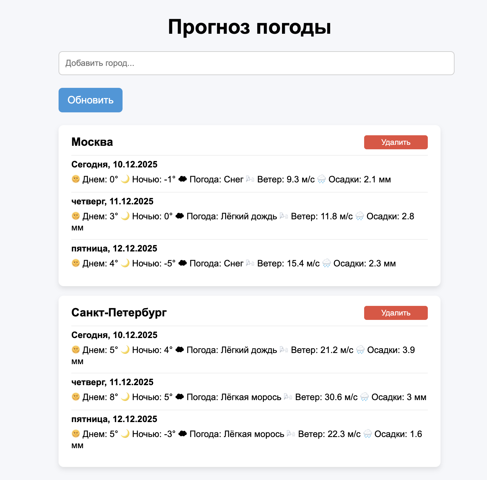

# web_programming_lab3_api_weather

Небольшое веб-приложение для просмотра прогноза погоды на сегодня и два дня вперёд для нескольких городов.
Поддерживает автоматическое определение локации, поиск городов с подсказками, удобный список прогнозов, обновление данных, удаление добавленных городов и обработку ошибок. Данные берутся из Open-Meteo API.

